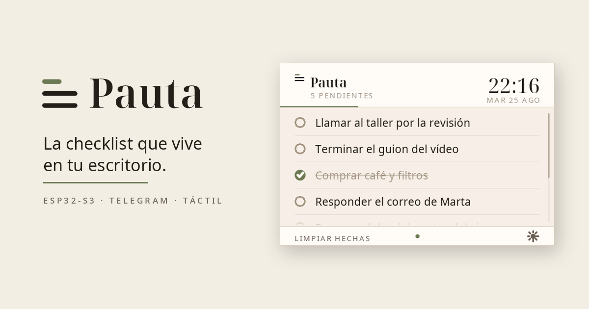
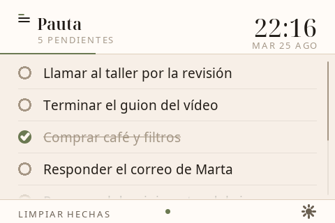
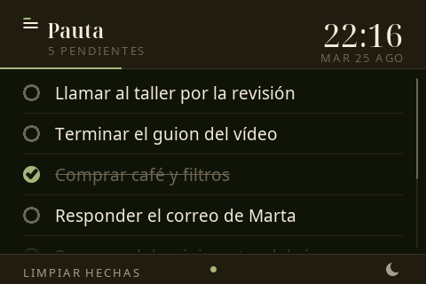
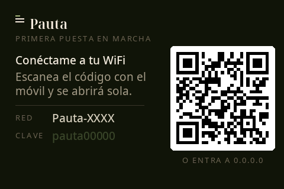
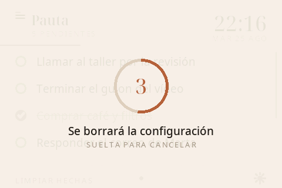

<p align="center">
  
</p>

<h1 align="center">Pauta</h1>

<p align="center">The checklist that lives on your desk.</p>

<p align="center"><a href="README.md">En español</a></p>

---

You text it on Telegram and it shows up on the screen. You tap a line and it
gets crossed off. No app to open, no tab to hunt for: it sits switched on next
to your keyboard, like a notepad that updates itself.

***Pauta*** is Spanish for the ruled guide lines of a notebook. It also means
the thing you're meant to follow.

## Using it

<p align="center">
  
  
</p>

Send the bot a message and it gets jotted down. Send several lines and it adds
one task per line. On the screen you tap a line to cross it off, and the bot
confirms it back to you.

| On Telegram | |
|---|---|
| *any text* | Jots it down |
| `/list` | See the list |
| `/done N` · `/undo N` | Cross off or reopen task N |
| `/del N` | Delete it |
| `/clear` | Remove everything crossed off |

| On the screen | |
|---|---|
| Tap a line | Cross it off, or reopen it |
| Drag | Scroll the list, with inertia when you let go |
| "Clear done" | Remove the crossed-off ones |
| Sun / moon | Switch between day and night paper |
| Hold the logo | Back to first-time setup |

Interface and bot speak **English or Spanish**; you pick during setup.

## What you need

- A **Makerfabs ESP32-S3 Parallel TFT with Touch 3.5"**.
  Both V1.0 and V2.0 work, but **they use different pins** and the firmware
  has to be told which. See [docs/hardware_en.md](docs/hardware_en.md).
- A USB-C cable.
- A Telegram bot: send `/newbot` to [@BotFather](https://t.me/botfather) and
  he'll hand you a token.

## Installing

The short version is: install `arduino-cli`, compile, flash.

```bash
git clone https://github.com/Ignacio-Aranda/pauta.git
cd pauta
```

Step by step, with dependencies and every option explained, in
**[docs/instalacion_en.md](docs/instalacion_en.md)**.

## First run

<p align="center">
  
</p>

The first time you power it on it has no idea which WiFi to join, so it
**brings up its own access point** and shows a QR code. Scan it with your
phone, it joins the device's network, and the setup page opens by itself: pick
your WiFi, type the password, paste your bot token, choose a language.

It reboots and that's it. Everything is stored on the board, and survives both
reboots and reflashing.

**The token is only ever typed into that page and only ever lives in the
board's flash.** It is not in this repository and never leaves the device.

### Changing WiFi or token later

<p align="center">
  
</p>

Hold your finger on the logo. After 3 seconds a 5-second countdown appears;
let go before it ends and nothing happens. Let it reach zero and the board
forgets its settings and returns to the setup portal, ready for a different
network or a new token.

## How it's built

- Networking runs on one core and the display on the other, so Telegram's long
  polling never freezes the touch response.
- Everything is drawn into a full-screen canvas in PSRAM and pushed in one go:
  about 8 ms a frame, no flicker.
- Accented characters render because the project **generates its own
  antialiased fonts**; the ones shipped with the graphics library are ASCII
  only.
- The Telegram connection pins the root CA in the firmware rather than
  accepting any certificate.

## Documentation

| | |
|---|---|
| [Hardware](docs/hardware_en.md) | The board, the pins, and which revision you have |
| [Installing](docs/instalacion_en.md) | Building, flashing and customising |

## License

MIT. See [LICENSE](LICENSE).
